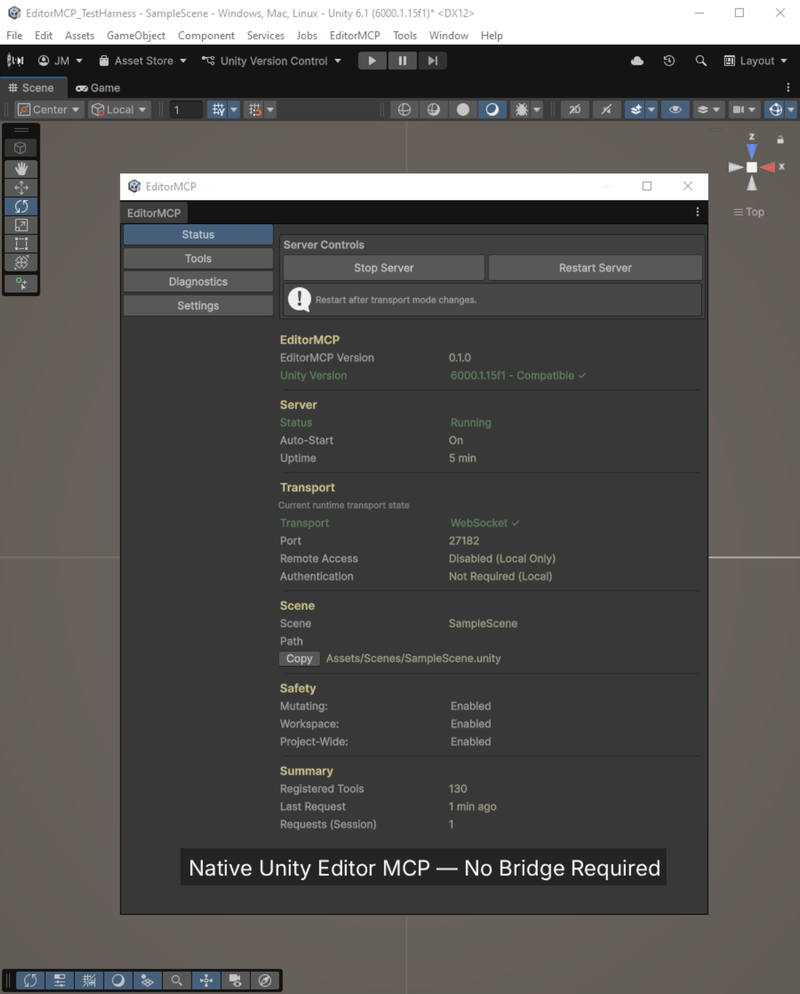
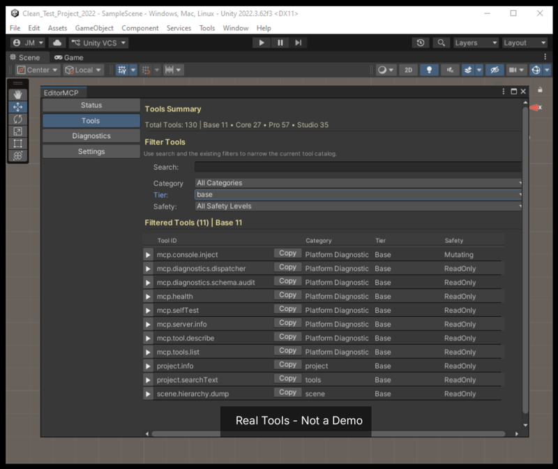
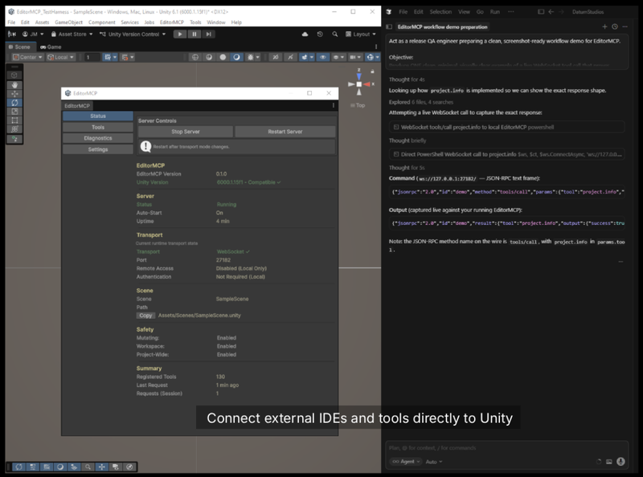

# EditorMCP

**EditorMCP** is a Unity Editor package that hosts an MCP (Model Context Protocol) server so MCP-capable clients can work with your project through a structured, editor-native integration.

If you use AI assistants or automation that speak MCP, EditorMCP connects them to Unity without shipping player/runtime code in this distribution.

EditorMCP is a Unity-hosted MCP automation platform that enables deterministic, structured interaction with your project through a curated tool surface.

<p align="center">
  
</p>

<br>

---

## What this repository contains

- **One UPM package:** `package/com.datumstudios.editormcp.base` — the **free Base tier** only.
- **Public install:** add the package via Git URL (see below), pinned to release tag **`v1.0.0`**.

Core, Pro, and Studio tiers are **not** published from this repo.

---

## What Base includes

- MCP server integration inside the Unity Editor
- Editor UI under `Window -> EditorMCP`
- A foundational MCP platform providing essential inspection, diagnostics, and transport capabilities
- Health and self-test flows to validate setup

<p align="center">
  
</p>

<br>

---

## What is not in this repo

- Core / Pro / Studio packages or payloads
- Samples
- Runtime or player build support — **Editor-only**

---

## Install (Unity Package Manager)

**Requirements:** Unity **2022.3** or newer (LTS recommended).

Add to your project’s `Packages/manifest.json`:

```json
{
  "dependencies": {
    "com.datumstudios.editormcp.base": "https://github.com/DatumStudios/EditorMCP.git?path=/package/com.datumstudios.editormcp.base#v1.0.0"
  }
}
```

Or in **Package Manager → + → Add package from Git URL**, paste:

```
https://github.com/DatumStudios/EditorMCP.git?path=/package/com.datumstudios.editormcp.base#v1.0.0
```

---

## Quick start

1. After install, let Unity finish importing and compiling.
2. Open **`Window -> EditorMCP -> Status`**.
3. Start the EditorMCP server (or enable auto-start in settings if available).
4. From your MCP client, call **`mcp.selfTest`** to confirm the connection.

<p align="center">
  
</p>

<br>

---

## Expected result after install

- No EditorMCP-related compilation errors in the Console.
- **`Window -> EditorMCP`** appears in the menu.
- The status window opens and the server can be started.
- **`mcp.selfTest`** completes successfully from your client once connected.

Package-specific notes and troubleshooting: see **`package/com.datumstudios.editormcp.base/README.md`**.

---

## Platform support

| Platform | Support |
|----------|---------|
| **Windows** | Supported |
| **macOS** | May work; not officially supported for v1 |
| **Player / runtime builds** | Not applicable — Editor-only package |

---

## Tier Overview

EditorMCP is delivered as a tiered system, scaling from a foundational MCP runtime to full automation workflows inside Unity.

| Tier | Purpose | What it enables |
|------|--------|----------------|
| **Base (Free)** | Foundation | Editor-hosted MCP runtime, transport, diagnostics, and inspection tools |
| **Core** | Visibility | Deeper project and scene inspection and structured read workflows |
| **Pro** | Authoring | Controlled mutation and day-to-day editor automation |
| **Studio** | Scale | Bounded batch operations, multi-scene workflows, and project-wide tools |

---

## 📦 Availability

- **Base (Free):** Included in this repository (proprietary license)  
- **Core / Pro / Studio:** Distributed via Unity Asset Store (pending publication)  

Store links will be added here once the packages are approved and published.

## Why Base matters

Base provides the core EditorMCP runtime inside Unity, including transport, health and self-test flows, tool discovery, and a practical inspection surface.

With Base, users can inspect project context, search project text under `Assets/`, dump scene hierarchy and component structure, and validate connectivity and runtime health.

That makes Base useful on its own for diagnostics, inspection, and custom integrations, while also serving as the foundation for the larger Core, Pro, and Studio tiers.

---

## Why EditorMCP Exists

Most MCP-style integrations focus on connectivity — exposing Unity functionality to external tools — but fall short in production use.

Common issues include:

- Unstable connections and dropped sessions
- Weak lifecycle handling (reloads, domain resets, play mode transitions)
- Unstructured or inconsistent tool responses
- Lack of safety boundaries for mutating operations
- Minimal observability and debugging support

These limitations make them difficult to rely on for real workflows.

### What Makes EditorMCP Different

EditorMCP is designed as a production-ready system, not just a bridge.

- **Editor-hosted runtime** — Runs directly inside Unity — no external bridge layer or fragile process syncing
- **Deterministic tool execution** — Structured inputs and outputs using a consistent ToolResult contract
- **Lifecycle-aware architecture** — Handles domain reloads, scene changes, and editor state transitions reliably
- **Explicit safety model** — Clear boundaries between read-only, targeted mutation, and higher-scope operations
- **Curated tool surface** — 130 tools designed, tested, and validated — not ad-hoc method exposure
- **Built-in observability** — Logging, diagnostics, and error visibility designed for real debugging

### Why This Matters

Instead of:

- writing one-off editor scripts
- debugging fragile integrations
- dealing with inconsistent tool behavior

You get:

- a structured, reliable automation layer inside Unity

---

## License

EditorMCP is **proprietary** software. See **`package/com.datumstudios.editormcp.base/LICENSE.txt`**. Third-party notices: **`package/com.datumstudios.editormcp.base/ThirdPartyLicenses.md`**.
